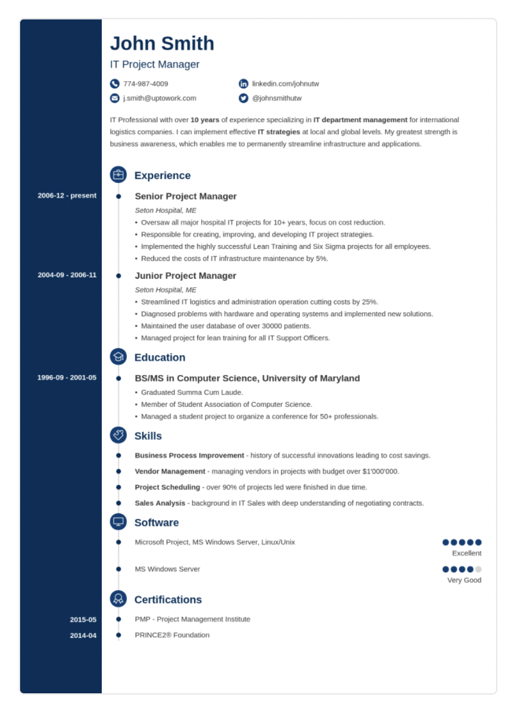

# CV Template

The goal was to build a cv template which looks excactly as below, but when the name of CV owner is clicked the color should be Changed randomly.
this is part of ATLP challenge.

#



## Tools used

Vanilla JS for changing the colors only, CSS, and a bunch of HTML, ViteJS

## How to run the project

1. Clone the repo
2. open the project
3. Use npm and run command

```
npm install
```

4. then run `npm run dev` or `npm run preview `

## Todo

- [ ] achieve 98%+ match with the design
- [ ] Convert HTML to reusable components using JS
